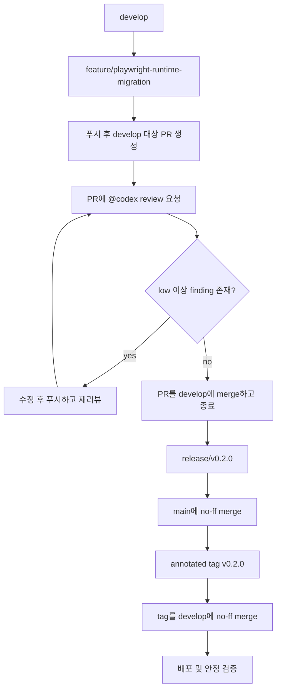

# Playwright 런타임 마이그레이션 구현 계획

> **에이전트 작업 시:** REQUIRED SUB-SKILL: `superpowers:subagent-driven-development`(권장) 또는 `superpowers:executing-plans`로 태스크 단위 실행. 진행 추적은 체크박스(`- [ ]`) 사용.

**목표:** 프로덕션의 Selenium + apt Chromium 런타임 경로를 Playwright(번들 Chromium)로 전면 교체하고, Git-flow release `v0.2.0`으로 배포한 뒤 검색/자동완성/지오코딩이 안정적으로 동작할 때까지 완료한다.

**아키텍처:** `TripTimeService` / 라우트 계약은 유지한다. 공유 Playwright 브라우저 수명주기 모듈과 3개 어댑터(소요시간 provider, browser autocomplete, geocode fallback)를 도입한다. feature는 PR로만 `develop`에 들어가며, `@codex review`에서 severity `low` 이상 finding이 없어질 때까지 반복한다. release finish로 `v0.2.0`을 태깅하고 배포·검증까지 수행한다.

**기술 스택:** Python 3.14, FastAPI, Playwright Python(번들 Chromium), 기존 TypeScript Playwright E2E, Docker/ENM 배포, GitHub PR + `@codex review`.

---

## 확정 결정


| 결정         | 선택                                                                                             |
| ---------- | ---------------------------------------------------------------------------------------------- |
| 범위         | A: duration provider + autocomplete + geocode fallback 전부 이전                                   |
| 버전         | 마이너 릴리즈 `v0.2.0` (hotfix/patch 아님)                                                             |
| Python     | 런타임/이미지 기준 **Python 3.14** (`requires-python`, Dockerfile base image 포함)                       |
| 브라우저 바이너리  | Playwright 번들 Chromium만 사용. Dockerfile에서 apt `chromium` / `chromium-sandbox` 제거                |
| Selenium   | release 마감 시 런타임 의존성과 프로덕션 코드에서 제거                                                             |
| 컷오버        | feature 브랜치에서 임시 비교는 가능하나, `develop` PR merge 및 `v0.2.0` 출시 시점에는 Playwright가 기본이고 Selenium은 삭제 |
| feature 통합 | PR + `@codex review` 루프. severity `low` 이상 finding이 없을 때만 `develop` merge 후 PR 종료              |
| 완료 기준      | merge/tag만이 아니라 배포 후 안정 동작 검증까지                                                                |


---

## Git-flow 절차 (필수)




### Feature 단계

1. 최신 `develop`에서 브랜치 생성: `feature/playwright-runtime-migration`
2. feature 브랜치에서 구현·커밋·푸시
3. `develop` 대상 PR 생성
4. PR에 `@codex review` 요청
5. finding severity가 `**low` 이상**(`low` / `medium` / `high` / `critical`)이면:
  - feature 브랜치에서 수정
  - 푸시
  - 다시 `@codex review` 요청
  - `low` 이상 finding이 없을 때까지 반복
6. 그 후에만 PR를 `develop`에 merge하고 PR를 닫는다
7. 로컬 fast-forward만으로 merge하지 않는다. 리뷰 이력이 남도록 PR 경로를 사용한다

### Release 단계

1. 갱신된 `develop`에서 `release/v0.2.0` 생성
2. 버전/배포 문서 안정화만 수행. 신규 기능 범위 추가 금지
3. release finish:
  - `main`에 no-ff merge, 메시지 `Merge branch 'release/v0.2.0'`
  - 해당 merge commit에 annotated tag `v0.2.0`
  - tag를 `develop`에 no-ff merge, 메시지 `Merge tag 'v0.2.0' into develop`
  - `main`, `develop`, tag 푸시
  - `release/v0.2.0` 삭제
4. 배포·검증까지 수행 (feature/release 중에는 dev, release 완료 시 prod 포함. 사용자가 prod 연기를 명시한 경우만 제외)

---

## 파일 맵

### 생성

- `src/trip_time_service/browser/playwright_runtime.py` — Playwright browser/context/page 수명주기, 풀 헬퍼, close/kill
- `src/trip_time_service/providers/naver_playwright.py` — 소요시간 provider + pool provider
- `src/trip_time_service/api/naver_playwright_autocomplete.py` — browser autocomplete pool
- `src/trip_time_service/api/naver_playwright_geo.py` — geocode fallback
- `tests/test_naver_playwright_*.py` — Selenium 중심 테스트를 대체하는 단위/어댑터 테스트
- `docs/superpowers/specs/2026-07-09-playwright-runtime-migration-design.md` — 짧은 설계 고정 문서(필요 시)

### 수정

- `[src/trip_time_service/providers/factory.py](src/trip_time_service/providers/factory.py)` — 기본 provider를 Playwright로, Selenium import 제거
- `[src/trip_time_service/config.py](src/trip_time_service/config.py)` — provider 기본값/환경변수 정리, Chrome/Selenium 전용 옵션 제거, Playwright 경로 필요 시 추가
- `[src/trip_time_service/api/main.py](src/trip_time_service/api/main.py)` — Playwright 런타임 startup/shutdown
- `[src/trip_time_service/api/geocode_services.py](src/trip_time_service/api/geocode_services.py)` — Playwright autocomplete/geocode 연결
- `[Dockerfile](Dockerfile)` — apt chromium 제거, Playwright Chromium 의존성 + `playwright install chromium`
- `[pyproject.toml](pyproject.toml)` / `uv.lock` — `playwright` 추가, `selenium` 제거
- `[deploy/enm/env/dev.env.example](deploy/enm/env/dev.env.example)`, `[deploy/enm/env/prod.env.example](deploy/enm/env/prod.env.example)`, 배포 스크립트 — provider/env 정리
- E2E/live 하네스(`playwright.config.ts`, `tests/e2e/run-live.mjs`, 문서) — `naver_selenium` 가정 제거
- `[docs/playwright-phase2-boundary.md](docs/playwright-phase2-boundary.md)` — 마이그레이션 상태/대체 메모

### 삭제 (PR merge / release 마감 시점)

- `src/trip_time_service/providers/naver_selenium.py`
- `src/trip_time_service/api/naver_browser_autocomplete.py` (Selenium 버전)
- `src/trip_time_service/api/naver_geo.py` (Selenium 버전) 또는 동일 경로 교체가 더 깔끔하면 in-place 교체
- `src/trip_time_service/chrome_driver.py`
- 재작성 불가한 Selenium 전용 단위 테스트

### 유지할 계약

- 좌표 우선 directions URL 경로 (`set_coords` / `_build_directions_url` 동등 동작)
- `/v1/trip/*` 요청/응답 형태
- 프론트엔드가 쓰는 autocomplete payload 필드 (`coords_ready`, lat/lon, labels)
- `geocode_services.py`의 HTTP `allSearch` ncaptcha backoff 동작

---

### Task 1: 브랜치 생성과 기준선 정리

**파일:**

- 브랜치만 생성. 제품 코드 변경 없음

- [ ] **Step 1: `develop` 동기화 후 브랜치 생성**

```bash
git fetch origin
git checkout develop
git pull --ff-only origin develop
git checkout -b feature/playwright-runtime-migration
```

- [ ] **Step 2: PR 설명 초안에 기준 장애 증거 기록**
  - Chromium 150 SIGTRAP / `SessionNotCreatedException`
  - Debian bug `#1141488`
  - 목표: Playwright 번들 Chromium + Selenium 전면 제거

- [ ] **Step 3: 문서 스캐폴딩이 필요하면만 커밋. 아니면 Task 2로 진행**

---

### Task 2: Python 3.14 + Playwright 의존성과 Docker 브라우저 전략

**파일:**

- 수정: `pyproject.toml`, `uv.lock`, `Dockerfile`, deploy env 예시, ruff/tooling 타깃

- [ ] **Step 1: Python 3.14로 런타임 기준 상향**
  - `pyproject.toml`의 `requires-python`을 `>=3.14`로 변경
  - `uv.lock` 재생성
  - ruff `target-version` 등 툴 설정을 3.14에 맞게 갱신
  - Dockerfile base를 `python:3.14-slim`(또는 동등 공식 이미지)으로 변경
- [ ] **Step 2: Playwright 추가, Selenium 프로젝트 의존성 제거**

```toml
requires-python = ">=3.14"
dependencies = [
  "fastapi>=0.110",
  "pydantic>=2.6",
  "playwright>=1.49",
  "tzdata>=2024.1; platform_system == 'Windows'",
  "uvicorn>=0.27",
]
```

- [ ] **Step 3: Dockerfile 갱신**
  - base image: Python 3.14
  - apt `chromium` / `chromium-sandbox` 제거
  - Playwright OS 의존성 설치
  - `playwright install chromium` 실행 (브라우저 캐시 기록 가능한 빌드 유저로 설치 후, 런타임 유저 실행 가능하도록 권한 정리)
  - `TTS_CHROME_BINARY_PATH=/usr/bin/chromium` 제거

- [ ] **Step 4: env 예시 갱신**
  - 기본 `TTS_PROVIDER=naver_playwright` (또는 `naver` alias가 Playwright를 가리키게)
  - 미사용이 되면 `TTS_CHROME_NO_SANDBOX` / apt-chrome 관련 주석 제거
  - pool size / headless 옵션은 Playwright 의미로 유지

- [ ] **Step 5: lockfile 동기화 후 커밋**

```bash
uv lock
git add pyproject.toml uv.lock Dockerfile deploy/enm/env/*.example
git commit -m "$(cat <<'EOF'
build: Python 3.14와 Playwright Chromium 런타임으로 전환

EOF
)"
```

---

### Task 3: 공유 Playwright 런타임 모듈

**파일:**

- 생성: `src/trip_time_service/browser/playwright_runtime.py`
- 생성: `tests/test_playwright_runtime.py`
- 이후 삭제: `src/trip_time_service/chrome_driver.py`

- [ ] **Step 1: launch/close/reuse 헬퍼에 대한 실패 테스트 작성**
- [ ] **Step 2: browser/context 팩토리 구현**
  - headless 기본 true
  - locale `ko-KR`
  - viewport 1920x1080
  - 현재 Naver 플로우와 호환되는 user-agent
  - worker별 user data dir 지원
  - timeout 기반 종료 + 프로세스 정리
- [ ] **Step 3: 단위 테스트 통과 확인 후 커밋**

---

### Task 4: 소요시간 provider Playwright 이식

**파일:**

- 생성: `src/trip_time_service/providers/naver_playwright.py`
- 수정: `src/trip_time_service/providers/factory.py`
- `tests/test_naver_selenium_*.py`를 Playwright 동등 테스트로 수정/생성
- 참고: `docs/playwright-phase2-boundary.md`

- [ ] **Step 1: 어댑터 seam부터 이식**
  - `open_directions_with_coords(route)`
  - `search_route_by_text(origin, destination)` — **DOM으로 선택 항목을 확인** (ARROW_DOWN만 쓰는 맹목 선택 금지)
  - `open_departure_picker()` / `set_departure_datetime()` / `read_duration()`
  - `close()`
- [ ] **Step 2: 단일 세션 provider + pool provider 구현**
  - duration cache 동작 유지
  - `pre_geocode_for_provider`가 쓰는 `set_coords` duck typing 유지
- [ ] **Step 3: factory 연결**
  - `naver`, `naver_playwright` → Playwright
  - 삭제 태스크 전까지 `naver_selenium` 임시 허용 가능
- [ ] **Step 4: parsing/calendar/adapter seam 단위 테스트**
- [ ] **Step 5: 커밋**

---

### Task 5: autocomplete + geocode Playwright 이식

**파일:**

- 생성: `src/trip_time_service/api/naver_playwright_autocomplete.py`
- 생성: `src/trip_time_service/api/naver_playwright_geo.py`
- 수정: `src/trip_time_service/api/geocode_services.py`, `src/trip_time_service/api/main.py`
- 테스트: `tests/test_naver_browser_autocomplete.py`, `tests/test_naver_geo_shutdown.py` 및 관련 runtime 테스트 재작성

- [ ] **Step 1: autocomplete pool 이식**
  - dynamic upper bound / idle TTL / metrics 개념 유지
  - 공유 Playwright 런타임 재사용
  - 프론트엔드 suggestion payload 계약 유지
- [ ] **Step 2: geocode fallback 이식**
  - Selenium 싱글톤 driver를 Playwright page/context로 교체
  - 앱 lifespan shutdown 훅 유지
- [ ] **Step 3: `main.py` startup/shutdown 연결**
- [ ] **Step 4: 테스트 후 커밋**

---

### Task 6: Selenium 완전 제거

**파일:**

- Selenium 모듈과 `chrome_driver.py` 삭제
- Selenium이 필요한 남은 import/테스트/스크립트 제거
- README / phase2 boundary 문서 갱신

- [ ] **Step 1: Selenium 런타임 모듈 삭제**
- [ ] **Step 2: factory에서 `naver_selenium` 거부**
  - Playwright로 안내하는 명확한 unsupported provider 에러 권장
- [ ] **Step 3: `uv run pytest`와 lint 통과, `src/`에 Selenium import 0건 확인**
- [ ] **Step 4: 커밋**

```bash
rg -n "selenium|webdriver\.Chrome|chrome_driver" src tests || true
```

---

### Task 7: PR 전 로컬·라이브 검증

**파일:** 수정이 필요하면 해당 수정만

- [ ] **Step 1: 단위/통합**
  - `uv run pytest`
  - `uv run ruff check .`
- [ ] **Step 2: Docker 이미지 스모크**
  - 이미지 빌드
  - 컨테이너 안에서 Playwright Chromium 기동 스모크
  - `/healthz`, `/api/config` 확인
- [ ] **Step 3: feature 브랜치 dev 배포**
  - 브랜치 푸시
  - `https://dev.triptime.enmsoftware.com` 배포
  - autocomplete, 출발 기준 검색, 도착 추천 스트림 검증
- [ ] **Step 4: 브라우저 E2E 증거**
  - desktop + mobile viewport에서 초기 / 상호작용 후 / 성공 화면 스크린샷
  - Naver captcha/네트워크로 live 경로가 막히면 failure bucket을 남기고 계속 수정. 가짜 성공으로 완료 처리하지 않음
- [ ] **Step 5: 검증 중 발견한 수정사항 커밋**

---

### Task 8: PR + `@codex review` 게이트로 `develop` 통합

**파일:** 없음 (프로세스)

- [ ] **Step 1: PR 생성**

```bash
git push -u origin HEAD
gh pr create --base develop --title "feat: Naver 런타임을 Selenium에서 Playwright로 이전" --body "$(cat <<'EOF'
## Summary
- duration / autocomplete / geocode를 Selenium + apt Chromium에서 Playwright 번들 Chromium으로 교체
- Selenium 런타임 의존성 제거
- 목표 릴리즈: v0.2.0

## Test plan
- [ ] unit/ruff 통과
- [ ] 컨테이너 Chromium 스모크
- [ ] dev 배포 검색 + autocomplete 성공
- [ ] desktop/mobile 스크린샷
- [ ] `@codex review`에서 low 이상 finding 없음

EOF
)"
```

- [ ] **Step 2: 리뷰 요청**
  - PR에 `@codex review` 코멘트
- [ ] **Step 3: 리뷰 루프 (하드 게이트)**
  - Codex review finding 파싱
  - severity가 `low`, `medium`, `high`, `critical` 중 하나라도 있으면:
    - 수정
    - 푸시
    - 다시 `@codex review`
    - 반복
  - `**low` 이상 finding이 없을 때만** 루프 종료
- [ ] **Step 4: PR를 `develop`에 merge하고 PR 종료**

```bash
gh pr merge --merge  # 또는 레포 표준 merge 방식
```

- [ ] **Step 5: PR 종료와 `origin/develop`에 merge commit 반영 확인**

---

### Task 9: Release `v0.2.0` finish

**파일:** `release/v0.2.0`에서 버전/배포 관련만 필요 시 수정

- [ ] **Step 1: release 브랜치 생성**

```bash
git checkout develop
git pull --ff-only origin develop
git checkout -b release/v0.2.0
```

- [ ] **Step 2: 최종 release 안정화**
  - version 문자열 / 배포 노트
  - 신규 기능 범위 추가 금지
- [ ] **Step 3: Git-flow finish**
  - `release/v0.2.0` → `main` no-ff merge
  - annotated tag `v0.2.0`
  - tag `v0.2.0` → `develop` no-ff merge
  - `main`, `develop`, tag 푸시
  - release 브랜치 삭제
- [ ] **Step 4: 대상 환경 배포 및 검증**
  - `/healthz`
  - `/api/config`에 `v0.2.0.x` 표시
  - 실제 검색 성공 (출발 기준 + 도착 기준)
  - autocomplete 성공
  - desktop + mobile 스크린샷
- [ ] **Step 5: 위 검증 통과 후에만 release 완료로 보고**

---

## 안정성 수락 기준

아래가 모두 참일 때만 완료다.

1. 프로덕션 `src/`에 Selenium import 없음
2. Docker 이미지 런타임 자동화에 apt Chromium 의존 없음
3. 배포 환경 검색이 `SessionNotCreatedException`으로 실패하지 않음
4. mock이 아닌 실제 Naver 기반 provider로 핵심 사용자 플로우 성공
5. autocomplete가 사용 가능한 후보를 반환하고, 가능하면 좌표 포함
6. desktop + mobile UI 증거 확보
7. feature PR는 `@codex review`에서 `low+` finding 제거 후에만 merge
8. Git 그래프가 `v0.2.0` Git-flow release finish와 일치

---

## 리스크와 대응


| 리스크                         | 대응                                                                 |
| --------------------------- | ------------------------------------------------------------------ |
| 이식 중 Naver DOM drift        | 좌표 우선 URL 경로를 먼저 보존. text-search는 DOM 확인 선택으로 재작성                  |
| Captcha / ncaptcha backoff  | 기존 HTTP backoff 유지. live 실패는 분류하고 가짜 성공 금지                         |
| Docker에서 Playwright 브라우저 설치 | 이미지 빌드에 `playwright install chromium`과 의존 패키지를 명시                  |
| 대형 PR 리뷰 반복                 | 커밋을 좁게 유지. 범위 추가 전에 review finding부터 해소                            |
| 임시 이중 스택 혼선                 | `develop` PR merge 전에 Selenium 삭제. 지원 prod provider로 둘을 동시에 남기지 않음 |


---

## 범위 밖

- provider 백엔드 교체를 넘는 프론트엔드 UX/API 계약 변경
- HTTP `allSearch` autocomplete를 browser-only로 완전 대체
- 브라우저 자동화 마이그레이션과 무관한 리팩터
- Debian Chromium 150용 patch hotfix(`v0.1.20`) — 이번 release로 대체하므로 보류

---

## 문서 작성 규칙

- 이 계획 및 이후 관련 설계/계획 문서는 **한글로 작성**한다.
- 코드 식별자, 명령어, 파일 경로, 커밋/PR에 필요한 영문 토큰은 그대로 둔다.

